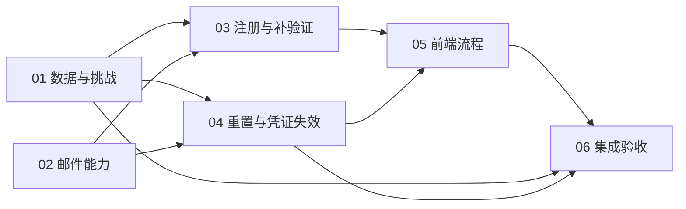

# 书魂 JWT 邮箱验证与找回密码：六份实施计划

状态（2026-10-03）：Plan 01–05 已实现；Plan 06 的本地验收通过，两包质量门及本机浏览器检查通过。用户随后回传隔离 DB 专用验收全部通过的输出，并确认验证码 / 登录及找回 / 改密基本流程正常；其余未反馈的外部用例、发布验收仍未完成，不能标总体验收完成或可上线。命令、结果、证据来源、限制及复核修复见[验收记录](../../../auth-email-acceptance.md)。原计划 checkbox 保留为逐项审查清单，实际完成证据以下表与验收记录为准。

| 计划 | 本次实际交付 | 未执行或严格未覆盖的部分 |
| --- | --- | --- |
| 01 | 增量模型 / 迁移、密码学与挑战服务、公开用户、数据库门禁与单测；隔离 PG 约束 / 挑战竞态通过 | 应用库迁移未执行；测试目标 / PG 版本 / 迁移列表待补充 |
| 02 | 共享 MailModule、固定邮件、可信 URL、有界队列、配置源码及空示例；用户确认验证码收件及找回 / 改密基本流程 | SMTP 回执、分类和供应商保留 / 费用验证；部署域名收件 |
| 03 | 验码注册、当前用户补验证、DTO / Cookie / HTTP / 服务拒绝路径；用户反馈验证码可用且进入登录状态 | 独立再次登录、补验证、重发拒绝路径与真实 PG 注册竞争 |
| 04 | 重置、版本鉴权、User 锁、旧凭证失效；隔离 PG 双排序 / 登录竞争 / 回滚用例通过；用户反馈找回 / 改密基本流程正常 | 打开链接不改密、过期 / 已用链接、旧凭证逐项 401 和线上联调 |
| 05 | 四条 UI、URL 清理、身份 generation、迟到 / 错码 / 过期 / 429 / 503 / StrictMode / hashchange 回归；验证码 / 登录及找回 / 改密手动反馈 | 其余真实后端及邮箱联调；浏览器实际显示记录见验收矩阵 |
| 06 | 窄 HTTP 集成、两包质量门、隔离 DB 套件通过、复核修复与验收 / 发布文档；认证专用入口与基本邮件流程反馈 | 未反馈的真实邮箱 / 联调 / 发布项目保留 NOT_RUN；DB 执行元数据待补充 |

**Goal：** 保留现有 JWT 登录，补齐邮箱验证、旧账号补验证、密码找回和改密后的凭证失效。

**Done：** 每份计划都有明确背景、目标、方案、影响、风险、输入 / 输出、实施步骤、测试命令及完成条件；六份共用一份接口基线，没有“后续自行决定”的关键安全空白。

**Scope：** 认证、用户元数据、现有 SMTP 复用、认证 UI 和验收；不修改书籍、会话、记忆的归属，不引入 Better Auth 或新生产依赖。

**Risks：** 注册契约变化、改密并发、数据库迁移和真实邮件配置。文档和默认 mock 测试不能替代隔离数据库及指定邮箱验收。

共同事实源：[设计基线](../../specs/2026-10-02-jwt-email-verification-password-reset-design.md)。先读基线，再执行具体计划；数值与接口以基线为准。

## 计划索引

| 计划 | 独立交付物 | 前置条件 | 独立验证 |
| --- | --- | --- | --- |
| [Plan 01 数据与挑战基础](01-data-and-challenges.md) | 扩展 schema / 新迁移、验证码与 Token 服务、测试库门禁 | 已有 Prisma / JWT 基础 | 摘要、有效期、次数、冷却、状态转换的 mock 测试；隔离 DB 约束检查单列 |
| [Plan 02 共享邮件能力](02-shared-mail.md) | 共享 SMTP 模块、固定认证模板、有界派发 | 设计基线；无需 Plan 01 已实现 | 模板 / URL / 队列测试、原有确认发信回归，全程 mock SMTP |
| [Plan 03 注册与旧账号补验证](03-registration-and-verification.md) | 验码注册、当前用户补验证、公开验证状态 | Plan 01、02 | 独立 Auth HTTP 测试；拒绝绕过、用途混用、跨用户和旧账号登录回归 |
| [Plan 04 密码重置与凭证失效](04-password-reset-and-revocation.md) | 找回 / 重置接口、版本鉴权、签发与刷新竞态保护 | Plan 01、02 | 重置事务 / Strategy 单测；实际竞态由 Plan 06 的隔离 DB 测试确认 |
| [Plan 05 前端认证流程](05-client-auth-flows.md) | 发码注册、补验证、找回、重置页面与状态处理 | 固定接口基线；可用 mock 开发，联调需 Plan 03、04 | Vitest 验证表单、异步竞态、冷却、URL 秘密清理与兼容 |
| [Plan 06 集成验收与发布说明](06-integration-and-release.md) | 跨接口回归、真实 DB 竞态用例、验收矩阵与发布 / 回退清单 | Plan 01–05 | 默认无外部依赖的两包质量门；隔离 DB、真实 SMTP 分别记录结果 |

“独立执行”指前置条件满足后，能只拿该计划及共同基线执行、测试、审查并交付；不表示六份都可以在没有前置实现时独立上线。Plan 05 可提前使用固定契约的 mock，不得把 mock 通过当作联调完成。

## 依赖关系与顺序

建议顺序：01 → 02 → 03 → 04 → 05 → 06。01 / 02 可分别开发；03 / 04 都会修改 auth.module / controller / service，默认顺序执行以减少冲突。前端可依据契约先写 mock 测试。

对应之前讨论的六部分：注册流程由 03 + 05 完成；找回流程由 04 + 05 完成；数据模型由 01 完成；旧凭证失效由 04 完成；邮件与界面由 02 + 05 完成；测试由各计划的相关测试和 06 的综合验收完成。这样避免把所有测试留到最后才发现接口不一致。

## 执行和授权边界

- 每个任务采用“先写失败测试 → 确认失败原因 → 最小实现 → 测试通过 → diff 审查”。本仓库未经要求不创建分支、提交、push 或 PR，计划中不包含自动 Git 提交。
- 先检查工作区、AGENTS.md、脚本和测试发现范围，保留已有改动。
- 六位码、链接找回、旧账号继续登录是已确认方向。数值策略是基线中的建议默认值，实施前评审统一基线即可，不为每个局部步骤重复询问。
- 配置源码 / 示例 / 部署设置的具体变更依 AGENTS.md 第 7、9 节展示后确认；不把“要实现邮箱功能”解释为可以修改真实 `.env` 或向真实邮箱发信。
- 所有默认测试 mock 数据库与 SMTP，不启动完整 AppModule 的外部 worker / Milvus / 模型链路。外部验收分别列出，不通过放宽安全门禁完成检查。
- 可以在完成一份后暂停，不把未完成份勾成完成，也不把局部实现部署为完整功能。

## 通用完成标准

- [ ] 该计划的输入 / 输出契约满足基线，正常与拒绝路径均验证。
- [ ] 相关测试先过，再运行受影响包的 `npm run check`；跨端契约最终运行两个包。
- [ ] 默认测试发现列表不包含 `.db.spec.ts` 或既有 Prisma DB 测试。
- [ ] diff 仅包含该任务必要源码、测试、迁移、对应文档，无实际秘密、日志或业务数据。
- [ ] 配置、真实数据库、真实邮件、部署等未执行项有明确原因，未伪报通过。
- [ ] 记录实际运行命令与结果后才更新计划状态；书籍、会话、记忆 owner 边界保持一致。

## 本次实施与验收

实施保留现有工作区与未提交文档，没有创建分支、提交、push 或 PR。测试按行为合并到服务 / 集成 / App suite；DB fixture 放在 `server/test/support/`，避免进入生产构建。完整结果和未执行原因统一维护在[验收记录](../../../auth-email-acceptance.md)，不以 mock 代替 PG 或实际收件。
