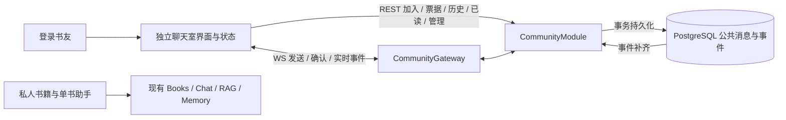

# BookSoul 公共聊天室设计与验收契约

**2026-10-05 补充：** 当前头像、人类 @、统一入口未读与逐消息可见已读，以及新版风景气泡界面，以[交互更新设计](2026-10-05-community-chat-interaction-design.md)为准。下文为已实施基线，冲突处按更新设计执行。

**日期：** 2026-10-04  
**状态：** 用户已批准 WS 依赖与开发代理；功能代码已实施，本地质量门与内存浏览器夹具已通过；真实数据库迁移及发布验收未执行，详见[验收记录](../../community-chat-acceptance.md)。  
**已确认范围：** 全站书友共用一个聊天室，交流阅读日常；私人书库与助手保持隔离；首期只做人与人聊天，`@AI` 放到后续阶段。  
**前端方向更新：** 用户于 2026-10-04 明确要求聊天室为独立页面，沿用 BookSoul 风格并参考 Summer 增加趣味；取代原先的全局弹窗方案。  
**传输方向更新：** 用户于 2026-10-04 选择改用 WS，并要求先审阅更新后的方案与依赖清单；本文替换原 REST 发送 + SSE 接收方案。  
**实施计划：** [公共聊天室实施计划](../plans/2026-10-04-community-chat.md)

**交互预览：** [书友客厅 HTML](../../previews/community-chat.html)。预览只使用模拟内容，展示页面布局及交互，不证明服务端能力、持久化或实时验收已完成。

本文在现有应用中加入独立的公共交流入口，借鉴 Summer 的引用回复、游标历史、未读提醒和滚动体验。消息发送、提交确认、实时广播和在线人数使用原生 WebSocket，由现有 NestJS 进程和 HTTP 端口承载；加入、历史、已读、撤回与管理保留 REST。以下是实现与发布验收的契约，逐项实测状态以验收记录为准。

## 1. 目标与完成条件

- **Goal：** 登录书友可以在一个公共聊天室稳定收发、引用和查看历史消息，不影响私人阅读闭环。
- **Done：** 两个不同账号可以双向收发；刷新、重连和服务重启后记录一致；重复发送只生成一条记录；撤回与管理隐藏可在离线后补齐；未登录和越权管理请求被拒绝；私人数据不出现在公共接口；通过本文验收矩阵及两个包的质量门。
- **Scope：** 新增 `community` 服务端模块、独立客户端状态与界面、增量 Prisma 迁移、相邻测试及文档。
- **非目标：** 多房间、邀请组、私聊、文件和图片消息、自动分享书籍/引用、自动防剧透审查、富文本编辑、搜索、推送通知、输入中状态、AI、模型/向量/记忆接入、多实例实时广播。
- **Risks：** 公共内容扩大可见性；实时连接增加资源消耗；新增数据库迁移；公共交流需要基本撤回和管理能力。真实数据库迁移、管理权限初始化和真实账号写入验收需要单独确认目标与影响。

## 2. 已调查的依据

调查基线是 2026-10-04 当前工作区，包含尚未提交的个人资料、头像和壁纸功能。实施前必须重新核对这些改动，不覆盖或回滚；聊天室不依赖私有媒体功能完成。

| 依据 | 当前事实 | 本方案的处理 |
| --- | --- | --- |
| `D:/summer-checkin/src/components/chatroom/chat-room.tsx` | 全局弹窗、引用回复、未读提醒；`PAGE_SIZE=50`、`WINDOW_SIZE=100`；顶部加载历史，用真实 DOM 锚点补偿 | 借鉴交互和窗口设计；新增内存上限，不复制其长期保留全部加载消息的状态方式 |
| `D:/summer-checkin/src/app/api/chat/messages/route.ts` | 游标历史接口；默认 100、最大 200，以 `createdAt/id` 排序 | 使用明确的序列游标；本项目默认 50、最大 100。Summer README 的首屏 50 与接口默认 100 有差异，不能照搬成契约 |
| `D:/summer-checkin/server/index.ts`、`server/room.ts` | WebSocket sidecar、Cookie 握手鉴权、连接内去重和限流 | 本项目使用现有 JWT；幂等和发送配额落数据库，重连/重启不会丢失；不复制消息正文日志 |
| [现有单书聊天入口](../../../server/src/chat/chat.controller.ts) | JWT、REST、手写 SSE、断开取消 | 复用认证能力；公共消息另建模块、表和 WS 协议，私人助手原传输保持原行为 |
| [API 客户端](../../../client/src/lib/api.ts)、[认证状态](../../../client/src/store/useAuthStore.ts) | `apiFetch` 带 Bearer、协调刷新；`authGeneration` 隔离旧身份响应 | 公共请求沿用这些能力；账号变化立即取消连接并清空状态 |
| [当前 schema](../../../server/prisma/schema.prisma)、[用户服务](../../../server/src/users/users.service.ts) | 私人会话使用 `ChatSessionRecord`；`PublicUser` 含账号 ID、邮箱；头像媒体有 owner 边界 | 不复用私人会话表，不直接返回 `PublicUser`，不公开私有头像 |
| [数据库测试隔离门禁](../../../server/src/prisma/testing/isolated-database.ts)、[服务端脚本](../../../server/package.json) | 显式 `TEST_DATABASE_URL`、独立 `*_test/test_*`；默认 Jest 排除 `.db.spec.ts` | 复用门禁，新建专用数据库测试入口；默认质量门保持无数据库连接 |

## 3. 方案取舍

| 路径 | 收益 | 代价 | 结论 |
| --- | --- | --- | --- |
| **NestJS Gateway + WsAdapter + 原生 WebSocket** | 双向发送与确认走同一连接；浏览器使用原生 API；沿用 Nest 生命周期及模块管理 | 新增服务端依赖；需要票据握手、逐帧校验、重放、心跳和背压 | 用户选择，本轮推荐实现方式 |
| 独立 WS sidecar，类似 Summer | 实时进程可独立扩缩 | 增加进程、端口与跨进程鉴权/广播协调 | 首期同进程更符合当前部署规模 |
| REST 定时轮询 | 实现最少 | 延迟和持续请求量较高 | 不满足本方案实时体验目标 |

首期明确支持一个 NestJS 实例。进程内广播只负责及时通知，PostgreSQL 的事件记录负责恢复。多实例部署需要另立共享广播、presence 和背压方案，不能把单实例验收当作多实例能力。



公共模块不导入 `BooksModule`、`ChatModule`、Agent、RAG、Memory、Milvus 或媒体存储服务。

### 3.1 依赖清单与配置影响（已批准并实施）

当前锁文件的 `@nestjs/common`、`@nestjs/core`、`@nestjs/platform-express` 都为 **11.1.17**；`ws` **8.21.3** 已作为间接依赖出现，但不能以间接依赖代替业务代码的直接声明。

| 包 | 位置 / 拟用版本 | 必要性 |
| --- | --- | --- |
| `@nestjs/websockets` | server 生产依赖；精确 11.1.17，与现有 Nest 锁定版本一致 | Gateway、WS 上下文与生命周期，避免自行搭第二套业务事件框架 |
| `@nestjs/platform-ws` | server 生产依赖；精确 11.1.17 | Nest 官方原生 WS 适配器，与浏览器 WebSocket 配合 |
| `ws` | server 生产依赖；精确 8.21.3，沿用当前间接依赖版本 | 显式使用服务端 socket 的 ping/pong、发送回调和 bufferedAmount，处理背压与关闭 |
| `@types/ws` | server 开发依赖；8.18.2，匹配 ws 8.x | 服务端 socket、upgrade 请求与回调的 TypeScript 类型 |

**必要性与替代方案：** 不引入客户端 WS 包、Socket.IO、Redis 广播或新进程。直接把 `ws` 挂在 Nest HTTP server 可少装两个 Nest 包，但需要自行维护消息分派与框架生命周期；本方案选择官方 Gateway/适配器。参考 [Nest 官方适配器文档](https://docs.nestjs.com/websockets/adapter) 与 [ws 官方使用文档](https://github.com/websockets/ws/blob/master/README.md)。适配器只扩展公共路径的握手鉴权及输入/背压边界；不另写完整 WS 框架。

**版本核对：** 2026-10-04 已核对注册表并按上表精确版本安装；peerDependencies 与 Nest 11 / RxJS 7 匹配，未安装 Socket.IO。npm ls 确认 adapter 的 ws 为覆盖后的 8.21.3；真实 HTTP/WS mock 业务 harness 与构建已通过。官方 npm audit 报告当前依赖树 64 项既有漏洞，未报告 ws 漏洞；未执行 audit fix 或改动无关依赖。

**同批申请的依赖覆盖：** platform-ws 11.1.17 的元数据固定依赖 ws 8.19.0；该版本受 [官方内存耗尽漏洞公告](https://github.com/websockets/ws/security/advisories/GHSA-96hv-2xvq-fx4p) 影响，修复始于 8.21.0，不能靠根目录直接声明 ws 8.21.3 排除嵌套旧版。拟在 server/package.json 增加限定于新增适配器的覆盖：

```json
"overrides": {
  "@nestjs/platform-ws": { "ws": "8.21.3" }
}
```

该覆盖与四个包一起获用户批准并已同步 lock；npm ls、audit 和真实 HTTP/WS harness 已验证新增 adapter 使用 8.21.3。没有覆盖其他包的 ws、升级现有 Nest 或启用消息压缩；扩大依赖范围仍须确认。

**已改配置：** `server/src/main.ts` 注册社区 WS 适配器，复用现有 HTTP server；`client/vite.config.ts` 给现有 `/api` proxy 增加 `ws: true`，target 保持原值。未新增环境变量、密钥、端口或修改 `.env`。生产代理如需新增 Upgrade 转发仍须另列真实配置差异并确认。

## 4. 用户流程与公开边界

1. 已登录应用的顶栏增加“书友客厅”，进入独立的 `#community` 页面；书库仍为主要入口。桌面聊天主栏加辅助侧栏，手机聚焦聊天主栏；全局连接管理保留一个实例，离开页面可收取未读信息，但不渲染隐藏聊天弹窗。
2. 首次点击先展示说明：“这里是所有已加入书友可见的公共聊天室。发送的内容和昵称会公开；请勿粘贴私密资料或未经允许的原文。群聊可能含他人主动发布的剧透，不受私人助手阅读进度限制。”明确点击“加入聊天室”才创建成员记录并读取历史，不因登录自动加入。
3. 展示将公开的当前账号昵称，允许返回账号设置修改。首期使用本地生成的默认头像，不读取或签发其他用户的私有头像 URL。昵称在消息发送时保存快照，修改昵称影响后续消息。
4. 加入后支持纯文本、引用回复、上滑查看历史、跳回最新、自有消息撤回。鼠标悬停和键盘焦点可见操作，手机有明确操作按钮。
5. 首次加载最新 50 条；接近顶部 200px 时加载更早记录。Enter 发送、Shift+Enter 换行；输入法组合状态不触发发送。
6. 发送状态为 `sending → sent / failed`。以提交后的 WS ack 或对应持久事件确认已发送；10 秒未确认标为可重试，保留内容和同一 `clientMessageId`，不推断未入库、不自动无限重发。
7. 距底部不超过 80px 且窗口位于最新端时跟随新消息；否则保留锚点，显示“N 条新消息”。只有当前处于聊天室页面、页面可见、窗口位于最新端且贴底时推进已读。
8. 顶栏未读角标最大显示 `99+`；回复自己的未读消息另有提示。离开聊天室页面不推进已读；加入成员可在应用内维持连接收取未读信息。首次加入将已读点设为加入时的事件水位，历史不计未读。

前端呈现以“书友客厅”为主题：沿用项目纸白、墨色、胶囊导航和宋体标题，以雾绿、旧书金和灰蓝作少量点缀；聊天主栏承载核心操作，右侧原生 SVG 书桌插画及三个开场提示提供趣味。开场提示只向输入框填入可编辑草稿；点击插画里的茶杯可填入“给大家倒杯茶，慢慢聊 🍵”，已有草稿时不覆盖。这些操作不读取私人数据、不自动发送；默认头像不调用私有媒体。表情选择仅插入 Unicode 文本。昼夜与背景选择复用项目外观设置，不引入消息反应、公共头像或额外社交数据模型。

公共业务数据只来自公共表，用户表仅用于鉴权与读取当前昵称；新接口不接受 `bookId`、`sessionId`、`ownerId`、发送者或角色等归属字段。正常输入中的书名或手动粘贴文本是用户主动公开内容，不触发私人检索，也不自动写入任何记忆。

## 5. 数据模型

新增四个模型，保留现有用户、书籍、私人会话和媒体模型的行为。固定公共房间标识 `readers-lobby` 由服务端决定；对客户端的首期接口不提供选房参数。测试可创建本次 fixture 专用房间，生产创建接口不对外开放。

| 模型 | 必要字段与约束 |
| --- | --- |
| `CommunityRoom` | `id`、`lastEventSeq BigInt @default(0)`、时间字段；服务端幂等创建固定房间 |
| `CommunityMember` | `id UUID` 作为公共成员标识；内部 `userId`、`roomId`；`consentVersion`、`lastReadSeq BigInt`、`isModerator @default(false)`、`mutedUntil`、发送配额窗口/计数、`joinedAt`；`@@unique([roomId,userId])`；用户关系使用 Restrict，未来账号删除需另行设计清理 |
| `CommunityMessage` | `id UUID`、`roomId`、`authorMemberId`、`authorName` 快照、`clientMessageId UUID`、规范化请求 `requestHash`、`content String?`、`replyToId?`、`createdSeq BigInt`、`createdAt`、`removedAt?`、`removalKind?`；`@@unique([roomId,authorMemberId,clientMessageId])`、`@@unique([roomId,createdSeq])`，索引 `[roomId,replyToId]`；作者关系 Restrict，引用关系 SetNull |
| `CommunityEvent` | 复合主键 `[roomId,seq]`；`kind MESSAGE_CREATED / MESSAGE_REMOVED / MEMBER_MUTED`、`messageId?`、`targetMemberId?`、内部 `actorMemberId`、管理原因、`createdAt`；禁言另存 `clientActionId?`、`requestHash?`、`mutedUntil?`，`@@unique([roomId,actorMemberId,clientActionId])`。事件不存正文/引用全文快照；管理字段仅服务端审计可读 |

发送、移除、禁言事务先锁定房间行，再进行成员/消息状态检查；对 `lastEventSeq` 原子递增，并在同一事务写业务记录与事件。固定锁顺序，失败回滚序列和业务写入。不要用独立自增序列或时间戳推断提交顺序，否则先分配、后提交的事务可能被重放游标跳过。

HTTP/WS 的序列全部是非负十进制字符串，不将 BigInt 转成 JS number。查询参数必须校验范围不超过有符号 64 位最大值。历史按 `createdSeq` 排序，事件按 `seq` 排序，两者不可混用。

## 6. HTTP 与 WS 事件契约

REST 路径以 `/api/community` 开头，使用 `JwtAuthGuard`、服务端 `CurrentAuth` 和成员查询。未登录返回 401；未加入返回 403 `COMMUNITY_JOIN_REQUIRED`。加入接口是创建本人 membership 的例外，无需已有成员记录。票据入口还校验 Origin 和已验证 JWT 的期限/版本；WS 握手独立按 6.1 校验，不能照用 HTTP guard。普通 HTTP 响应沿用 `{ success: true, data }`，`Cache-Control: no-store`。

| 方法与路径 | 输入 | 输出或效果 |
| --- | --- | --- |
| `POST /membership` | `{ consentVersion: "2026-10-04" }` | 幂等加入；返回自己的 `memberId`、`isModerator`、`mutedUntil`、`lastReadSeq`、`unreadCount`、`replyUnreadCount`、`latestEventSeq` |
| `GET /me` | 无 | 仅本人可见的上述成员状态及未读摘要；未读只计仍可见、他人发送、`createdSeq > lastReadSeq` 的消息 |
| `GET /messages` | `before?` 或 `after?`，不能同时有；`limit` 默认 50、最大 100 | 正序 `messages`、`hasMore`、`nextCursor`、`latestEventSeq`；无游标取最新，before 取之前，after 取之后；游标为消息 `createdSeq`，严格边界，不要求该消息仍可见 |
| `POST /ws-tickets` | 无业务参数；Bearer 及合法 Origin | 返回 `{ ticket, expiresAt, protocol: "booksoul.community.v1" }`；仅本人已加入后可申请，一次性、最长 30 秒；连接超额返回 429 |
| `DELETE /messages/:id` | 无 | 仅作者撤回；首次清空正文并写移除事件，重复撤回为成功；不能撤回他人消息 |
| `POST /read` | `{ throughSeq }` | 单调更新自己的已读点并返回摘要；不得大于当前事件水位；从不修改别人的状态 |
| `POST /moderation/messages/:id/hide` | `{ reason }`，1–200 个 Unicode code point | 服务端查 `isModerator`；清空正文、写管理事件；重复隐藏为成功 |
| `POST /moderation/members/:memberId/mute` | `{ clientActionId: UUID, minutes: 10 或 60, reason }` | 服务端查管理权限；覆盖为至少该到期时间；同一管理幂等键重试返回原结果，不延长禁言；返回管理侧结果并记录审计事件 |

禁言接口使用首次成功处理时间计算到期，并保存到事件。同一管理员的 `clientActionId` 重试返回原到期时间，即使服务重启或长时间断网也不延长；同一 key 改目标、时长或原因返回 409。新的管理动作使用新 key，目标到期时间取当前到期与新计算值的较大者。目标不存在返回 404；禁止禁言自己或其他管理员（403）。首期不做永久封禁、管理员角色授权 API 或独立管理后台。

`MessageDTO` 精确定义为 `{ id, seq, clientMessageId, author: { memberId, name }, content: string|null, status: "ACTIVE"|"REMOVED", createdAt, replyTo: null|{ id, memberId, name, excerpt: string|null, status: "ACTIVE"|"REMOVED" } }`。`excerpt` 最多 120 个 code point。公共成员 ID 不等于账号 ID；DTO 不含邮箱、完整账号标识、authVersion、私有路径、媒体链接或审计原因。引用当前已移除的消息返回 410 `COMMUNITY_REPLY_UNAVAILABLE`；传入私人消息 ID、其他房间消息 ID 和不存在的 ID 一律 404，不披露其类型。

### 6.1 WS 握手与身份

唯一 WS 路径为 `/api/community/ws`，与 REST 共用现有端口。HTTPS 页面使用同源 `wss://`，本地 HTTP 使用同源 `ws://`。浏览器原生 WebSocket 构造参数不能沿用 `apiFetch` 的自定义 Bearer 请求头，因此采用以下流程：

1. 明确加入后，客户端经现有 `apiFetch` 请求 `POST /ws-tickets`。服务端校验 JWT、成员、Origin，取得已验证 JWT 的 `exp` / `authVersion`，生成 32 字节密码学随机票据；有效期取 `min(now+30秒, JWT exp)`。
2. 票据仅保存在客户端内存。服务端只存其 SHA-256 摘要及可信 user/member/room、authVersion、JWT 截止、Origin；每成员最多 2 张未使用票据、全进程最多 200 张，按过期时间清理。票据不复用 JWT、不新增签名密钥，重启失效后重新申请。
3. 客户端用 `new WebSocket(url, ["booksoul.community.v1", "ticket.<一次性票据>"])` 发起握手。URL 不携带凭据；服务端只协商返回 `booksoul.community.v1`，不能把 ticket 子协议回显。应用及代理不得记录 `Sec-WebSocket-Protocol`、Authorization 或票据响应体。
4. 适配器在 HTTP `upgrade` 阶段先检查路径、协议、Origin，再原子取走票据并重新核对用户存在、authVersion、JWT 到期、成员和容量；成功后才调用 `handleUpgrade` 返回 101。过期/重用票据拒绝 401，非法 Origin/成员拒绝 403，超容量 429，整个握手最多 10 秒。异步等待期间预约连接容量，所有失败/断开/超时释放预约，避免并发穿透上限。
5. WS 的 Origin 必须命中现有 `CORS_ORIGINS` 的同一 allowlist，缺失也拒绝；CORS 中间件不能替代 WS 检查。HTTP 票据入口同样要求合法 Origin，票据绑定该 Origin。公共连接身份来自票据，客户端不能指定 userId、房间或角色。

使用官方 WsAdapter 的限定扩展，在 upgrade 前执行异步鉴权；不能以 `handleConnection` 中鉴权后再踢出代替握手拒绝，也不能照用只适配 HTTP 的 `JwtAuthGuard` 处理消息。参考 [ws 官方握手鉴权示例](https://github.com/websockets/ws/blob/master/README.md#client-authentication)。浏览器不能读取升级失败的 HTTP 状态；客户端显示连接失败，并在有界重连中重新走票据 REST，由该入口识别 401/403/429，不能从通用 `onerror` 猜出鉴权失败。

### 6.2 双向帧与提交确认

协议 v1 仅接受文本 JSON，统一信封为 `{ event: string, data: object }`，与 Nest WsAdapter 的默认形式一致；数据先按 unknown 校验、拒绝额外字段，不能因适配器默认忽略未知事件而静默成功。

| 方向 / event | data | 语义 |
| --- | --- | --- |
| 服务端 `connection.ready` | `{ protocolVersion: 1 }` | 已鉴权；客户端此时进入 SYNCING，不能直接视为已恢复 |
| 客户端 `connection.resume` | `{ after: string }` | 每次连接仅一次；首次用历史快照的事件水位，重连用最后成功处理的事件游标 |
| 服务端 `sync.complete` | `{ throughSeq: string }` | 补齐已完成，进入 READY；该水位之前的持久事件须先有序交付 |
| 客户端 `message.send` | `{ clientMessageId: UUID, content, replyToId?: UUID }` | READY 后可发；服务端用可信身份调用同一持久化服务 |
| 服务端 `message.ack` | `{ clientMessageId, message: MessageDTO }` | 仅发给发送连接；事务提交成功后才发，含幂等重试；表示已入库，不表示他人已阅读 |
| 服务端 `message.created` / `message.removed` | `{ seq: string, message: MessageDTO }` | 有序公共持久事件；此 seq 是事件序列，message.seq 是创建序列 |
| 服务端 `cursor` | `{ seq: string }` | 管理审计事件仅推进公共游标，不公开目标、操作者或原因 |
| 服务端 `presence` | `{ onlineCount }` | 按有效 WS 的不同成员去重，不按 tab 计人数、不返回名单 |
| 服务端 `heartbeat` | `{}` | 每 15 秒发应用心跳供浏览器检查空闲；不推进游标 |
| 服务端 `reset` | `{ reason: "CURSOR_TOO_OLD"|"SLOW_CONSUMER" }` | 清除消息/引用缓存，重新获取最新快照和摘要；不宣称已读完整旧历史 |
| 服务端 `auth.expired` | `{}` | JWT 到期，关闭连接；客户端经现有刷新协调取得新票据 |
| 服务端 `error` | `{ code, status, clientMessageId?: UUID, retryAfterSeconds?: number }` | status 表达原 HTTP 语义，例 400/403/409/410/429；业务失败不伪装成 ack，格式/协议错误终止连接 |

`message.ack` 与 `message.created` 到达顺序不作保证；客户端按 messageId 和 clientMessageId 合并，任一权威确认可结束 sending。10 秒未得到提交确认显示“未确认，重试”，不推断事务失败、不生成新 key、不自动重发。迟到确认仍合并原消息。幂等键相同且规范化内容/回复相同返回原消息；改参数发 409 `COMMUNITY_IDEMPOTENCY_CONFLICT`。ack、ready、presence、heartbeat 不能推进持久游标。

业务错误使用同一稳定错误码；禁言、配额等只拒绝该次发送，允许继续阅读。坏 JSON、未知事件、二进制帧或非法信封发协议错误后关闭 1008；超出字节上限关闭 1009。授权失效关闭 4003，JWT 到期关闭 4001；重置关闭 4009，慢连接关闭 4010，服务停止关闭 1012。4001 最多协调刷新一次；4003/1008/1009 不自动重连；4009/4010 先重取快照再按有界规则重连；1012/异常网络断开按有界规则重连。close reason 只含稳定代码，不含身份或正文。

历史与水位在一个 RepeatableRead 事务中读取。处理 resume 时先注册实时监听并缓存，再补齐 after 之后的事件，最后按序排出、去重并发 sync.complete；不能采用“先读历史，后订阅”而留下窗口。超过当前水位的游标返回 400 协议错误并关闭，不能静默跳过。事件重放根据当前消息状态投影，已移除正文不会通过旧 created 事件再次返回。客户端处理移除时清除所有相关引用 excerpt，包括窗口外缓存。首次同步前或同连接重复 resume 拒绝；同步超时必须释放连接。

## 7. 有界执行与恢复

以下是首期建议固定值，放在 `community.policy.ts`，不增加 `.env` 配置；修改值需同步契约及测试。

| 项目 | 默认值与语义 |
| --- | --- |
| 发送内容 | trim 后 1–2000 个 Unicode code point；保持现有 HTTP JSON 解析上限，不为此改全局 parser；只渲染纯文本，保留换行，不自动解析 HTML、Markdown、图片或链接 |
| 发送配额 | 每成员每 60 秒最多 20 次成功新消息，事务内持久检查；幂等重试不占配额；WS error 带 retryAfterSeconds，HTTP 429 带 Retry-After。现有全局限流只覆盖 HTTP；WS 另行限制每连接每 10 秒最多 60 个入站应用帧，超限关闭 1008，不以重连替代成员持久配额 |
| 连接数与票据 | 每成员最多 3 个 WS，实例总计 100（含鉴权中预约）；票据最长 30 秒、每成员 2 张、全进程 200 张；超限 429 |
| 心跳与鉴权 | 每 15 秒 protocol ping 与应用 heartbeat；10 秒未收 pong 终止。每 15 秒复查用户、authVersion、成员，失败关闭；每次发送另复查身份再执行业务；到 JWT exp 立即关闭并重新鉴权。健康连接不定时轮换；撤销后读取最迟 15 秒关闭，新发送即时拒绝 |
| 超时 | 普通请求/握手/提交确认各 10 秒；resume 同步最多 10 秒；浏览器连续 45 秒无任何应用帧主动断开；不使用普通请求超时取消健康 WS |
| 断线重连 | 瞬时网络/5xx 按 1、2、4、8、16 秒加最多 20% 抖动；连续失败 5 次停下显示“重试”，完成同步且稳定 30 秒才清零失败计数；每次取新票据。401/4001 最多协调刷新一次；403/4003 不重试；429 尊重 Retry-After，最多 5 次 |
| 数据恢复 | 同一进程每 1 秒进行一次公共事件补扫，避免“提交后、广播前”故障漏发；补扫按房间串行，不为每个客户端各建轮询器 |
| 帧与背压 | 入站单条完整消息 maxPayload=16 KiB，只接受文本，perMessageDeflate=false；业务上限仍为 2000 code point。入站串行处理、待处理最多 20 帧；出站队列最多 100 帧，bufferedAmount 最多 256 KiB、单次发送回调等待最多 5 秒；超限尽力发 reset 并关闭，最多再等 5 秒强制 terminate；慢连接不阻塞其他人 |
| 重放 | 单批 100 事件；落后超过 1000 发 reset；只有成功应用的持久事件推进客户端 cursor；WS close 无法携带完整 reset 时，也必须依据 4009/4010 执行快照恢复 |
| 客户端窗口 | 每页 50、最多挂载 100 条（含待发消息）、最多缓存 500 条已确认消息；超出按整页淘汰非当前窗口记录，回看缺失页重新请求；待发消息单独限 20 条，超过禁止再排队，待发消息占用列表挂载额度 |
| 离开与账号变化 | 离开聊天室页面保留有界数据和当前账号草稿；退出登录、账号/authGeneration 改变时清空草稿、消息、未读与定时器，abort 所有请求；禁止将公共消息和草稿写 localStorage |

历史请求一次只允许一个在途，失败后显示手动重试。切换窗口前记录首个可见消息 ID 和 top，布局完成后用真实 DOM 差值补偿；加载与新消息同时发生时按 ID 合并，不整体覆盖。远离最新端时不把未显示消息当成已读。除账号代次外，每次 WS 连接还有独立连接代次；同账号旧连接的迟到回调不能关闭或改变新连接。票据、历史、已读/摘要请求也隔离陈旧响应，不能回退已读点或用旧摘要覆盖更新后的未读。

服务端在关闭连接时释放监听、缓冲、容量预约和定时器；进程关闭时停止补扫并清理未使用票据；每连接的终止事件最多一次，close/terminate 幂等。日志只记录 run/request 标识、阶段、耗时、计数和错误码，不记录正文、昵称、Token、Cookie、邮箱、私有路径或请求体。首期无内容自动到期清理；撤回/隐藏清空正文但保留最小事件和幂等信息，数据库备份的既有保留策略不在此功能中改写。

## 8. 撤回、管理与部署

加入者均可读历史、发消息并撤回自己的消息；禁言只限制新消息发送，不取消阅读能力。公共消息没有编辑入口，避免历史与引用版本歧义。

至少提供管理员的“隐藏消息”“禁言 10 分钟/1 小时”操作。权限来自 `CommunityMember.isModerator`，接口每次服务端反查；客户端传角色或改按钮不能获权。管理员隐藏与作者撤回对普通用户统一显示“消息已移除”，引用同时清空。已发送给他人的内容无法保证消除其截图或自行保存的副本。

提供专用、默认只预览的管理初始化命令，用公共 memberId 精确定位目标；`--apply` 才写入授权。真实执行前展示脱敏目标指纹、目标成员和影响 1 行，取得确认；不要在应用启动或迁移中自动挑选首个用户作为管理员。公开上线前必须完成管理员初始化与隐藏/禁言验收。

迁移只新增公共表及必要关系，不修改已应用迁移、不搬迁私人会话。数据库测试仅在独立测试目标运行；真实迁移另行核对备份与恢复路径。回退旧应用二进制可停止公共入口，公共表保留以便恢复，不通过 DROP 或清空数据回滚。

WS 部署代理必须实际验证 `/api/community/ws` 的 Upgrade 转发、子协议传递、Origin 保留、WSS 与空闲超时大于心跳间隔；检查代理日志不记录票据子协议。Vite 开发代理的 `ws: true` 修改见 3.1，批准后实施。本轮不修改生产代理；若需要改参数，实施时列具体差异并确认。禁止新增无鉴权 WS 地址、把 Token 放 URL 或静默退回轮询/SSE 作为连通性补丁。

## 9. 验收矩阵

全部用脱敏 fixture。涉及数据库和浏览器实际写入的验收仅连接经门禁确认的隔离测试服务，不连接当前实际使用的应用库；缺少环境时准确记为未运行。

| 编号 | 场景与步骤 | 通过标准 | 层次 |
| --- | --- | --- | --- |
| C01 | 未登录申请票据/历史、未加入申请票据；缺失/重用/过期票据握手，伪造或缺失 Origin | HTTP 分别 401/403；upgrade 拒绝且不返回 101；拒绝前不查询公共消息；票据只能消费一次、不能出现在 URL/日志/响应协商协议 | HTTP/适配器单测 + WS harness |
| C02 | A 加入，B 加入，分别发送 | 昵称/默认头像正确；两边各出现一条；同机隔离验收服务正常运行时提交至对端可见目标 ≤1.5 秒 | DB + 双浏览器 |
| C03 | 同 key 并发、提交后丢失 ack/广播、断网和重启后重试；换内容重用键 | 仅一条消息和创建事件；相同请求 ack 返回同 ID；ack 与 created 任意顺序只显示一个气泡；换内容 error status=409；确认只在提交后发送 | DB 并发 + WS harness |
| C04 | A 引用 B；引用不存在、私人 ID、其他房间 ID | 正常引用最多 120 个 code point；非法目标均 404；已移除目标 410 | 单测 + DB |
| C05 | 历史加载途中新增消息，同时刻批量发消息 | 每个 ID 只出现一次；before/after 严格排序；快照到订阅间消息不丢 | 单测 + DB |
| C06 | B 离线，A 发消息、撤回，B 重连；模拟事务提交后进程广播失效 | 重放与补扫补齐；已撤回正文不出现；缓存的引用 excerpt 清空 | 流单测 + DB + 浏览器 |
| C07 | A 看旧记录，B 发 20 条；切到书库再返回，切到后台 | 不强制跳底，不错误推进已读；提示准确；草稿保留；首次加入历史不计未读；自己的消息不计未读 | 状态单测 + 浏览器 |
| C08 | 加载 1000 条变长 fixture，往返跨缓存边界 | DOM 消息节点 ≤100、缓存 ≤500、无消息空洞；前插/换页锚点偏差目标 ≤8px，记录视口与截图 | 浏览器 |
| C09 | WS 中 JWT 到期、撤销 authVersion、退出 A 后登录 B；健康连接跨 60 秒 | 到期关闭 4001；撤销后发送立即拒绝、读取最迟 15 秒断开；健康连接不强制轮换；刷新有界；A 的迟到票据/帧/草稿/摘要不进入 B；同成员 2 个 tab 只计 1 人 | 单测 + 浏览器 |
| C10 | 空白、2000/2001 code point、HTML、伪造归属；坏 JSON、未知事件、二进制、超 16 KiB、重复 resume、同步前发送 | 业务边界按契约接受或 error status=400；HTML 为文字；协议错误关闭 1008、超大消息 1009；未知事件不静默丢弃；不接受归属字段 | DTO/WS/界面单测 |
| C11 | 多连接合计第 21 条、重连继续发送、帧洪泛、慢客户端、并发握手达上限、断开重试持续失败 | 持久配额不可绕过，幂等不扣配额；HTTP 429 / WS retryAfter 明确；帧/队列/字节/超时有界；预约释放、慢连接不拖住其他人；5 次失败停下，不因短连接反复 open 无限重试 | 单测 + DB + WS harness |
| C12 | A 撤回 B；普通成员调用管理接口；管理员隐藏/禁言；重复管理请求 | 越权 403；隐藏补齐到各端；禁言期发消息 403、到期恢复；重复不产生重复移除或延长禁言 | 单测 + DB |
| C13 | 为 A/B 建私人书、私人会话和记忆后读公共接口；检查 WS 和日志 | 没有上述私人数据、邮箱、完整账号 ID、头像签名 URL、票据或正文日志；公共模块无私人检索调用 | 边界单测 + 隔离 fixture |
| C14 | 375×812 与 1440×900、亮/暗主题、键盘/IME、页面导航与确认框 | 独立页面无横向溢出；只有加入/撤回确认框限制焦点，Escape 关闭并返回触发按钮；IME 不误发，窄屏可操作；开场不自动发送 | 界面单测 + 浏览器 |
| C15 | 默认 Jest 发现范围、两个包 check、数据库门禁拒绝样例 | 默认发现不含 `.db.spec.ts`；两个 check 通过；缺失/相同数据库/错误命名在连接前拒绝 | 质量门 + 门禁单测 |

C02 和 C08 是待验证的验收目标，不能引用 Summer 的 benchmark 数字宣称 BookSoul 已达到。浏览器验收必须保存操作步骤、实际结果、截图及未运行原因；仅通过状态单测不算滚动或移动端验收。

## 10. 后续 AI 阶段

首期 `@AI` 是普通文字，不生成模型请求。后续若启用，需要单独确认群聊到现有供应商的数据流、上下文范围、费用和公共回复预期。只能读取明确允许的公共消息，不能借用私人 Agent/RAG/Memory；必须有提示词注入测试、确定性权限与预算、持久运行幂等、取消和终止事件契约。首期不预建 AI 虚拟账号、模型切换、向量或相关字段。
