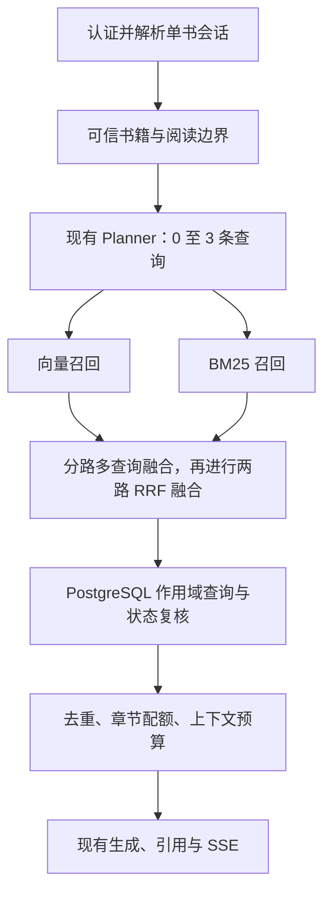

# 第一阶段：单书混合检索技术方案

日期：2026-10-05。状态：经用户技术评审修订，暂停原方案实施，先完成选型对比。

## 生效修订（2026-10-05）

本节替代下方原稿的固定 Milvus 选型、等权融合、阶段门槛与版本规则。下方原稿保留为被评审的历史设计，不作为执行契约；实施以本节及已修订计划开头的任务为准。尚未修改生产代码或执行真实数据操作。

### A. 先比较作用域内 BM25，不预设词法索引进 Milvus

正文已在 BookChunk，词法检索不必依赖向量库。优先验证一个最小候选：服务端从 PostgreSQL 查询当前有权访问的书籍、有效 embeddingVersion、READY 状态、sectionOrder <= spoilerCeiling 的全部块，仅在这些可见块上计算 BM25。

语料集合 C 必须先由数据库授权查询确定。N=|C|、df(t)、avgdl 都只从 C 得到；不能先按查询词筛出命中块再计算这些统计，不能仅过滤召回结果而复用全书/全局 IDF。正文继续只在现有应用和数据库之间流动，不新增向量库原文副本。

首个探针按请求构造临时表示、不缓存正文；用同一个数据库一致性快照读取书籍状态与块。分页读取时仍用同一快照，查全语料后才能排序，不允许只取前若干块当作全部可见语料。取消可达，设定扫描字节数/块数/时间/内存上限，超限明确报告，不静默截断或切换全局统计。

中文 tokenization 是独立变量：本地先评估现有 Node 的 Intl.Segmenter 与字符 n-gram 等无需生产依赖的候选，验证专名、中英数字、罕见名称及原句片段。它们不等同于 Jieba，也不承诺短语精确匹配。若需要额外分词依赖/数据库扩展，先提供具体必要性和替代实验，再取得确认。

对比至少三项：① 当前纯向量路径；② PostgreSQL 可见语料 + 本地 BM25；③ 有隔离服务时，Milvus/Zilliz 原生 BM25。原生 BM25 与本地分词不同的结果不能直接归因于 IDF：另用同分词的可见语料/全局语料打分对照，隔离统计作用域的影响。

加入其他书、未读章节、失败/旧代次的扰动后，本地 BM25 对相同可见语料的排名与分数应不变。集合级统计的原生 BM25 不承诺这项性质；过滤仍必须保证原文不返回。Milvus 官方说明其查询编码依赖全局统计：[Full-Text Search under the hood](https://blog.milvus.io/blog/full-text-search-in-milvus-what-is-under-the-hood.md)。

按可见块数、UTF-8 字节数及并发量做合成梯度实验，覆盖已读完长书；不以“单书”推断一定小。记录冷请求读取量、扫描/分词/评分时间、p95 与内存。先决定本地扫描是否满足预算，再讨论持久词频或倒排索引；两者仍可保留可见语料统计，不需要因此搬正文到 Milvus。

当前倾向是本地可见语料 BM25，因为隔离统计与数据最小化更符合产品边界；这是待实验确认的推荐，不是已完成的选型。

### B. 冻结今天完整纯向量基线，分开检索与查询实验

核对当前 BookContextPlannerService：LLM 路径已经把原问题放在 uniqueQueries 的首位，uniqueQueries 最终 slice(0,3)。因此撤销任何重复改写 Planner 的实施项，本阶段保持既有查询生成、脱敏、追问上下文和模型参数。

主基线 B0 是今天完整路径：冻结代码/工作区内容摘要、语料/版本/阅读上限、现有 Planner 输出、查询 embedding、向量候选列表、原有融合和并列次序、去重配额及字符预算。未提交源码用内容摘要定位，不提交私人数据。

各候选使用 B0 相同的查询与数据快照。B1 仅改变候选数，B2 仅改变融合/并列规则，B3 才加入词法召回，分别报告相对 B0 的逐题变化；如以后需要改查询集合，增加独立消融实验，不混入本阶段收益。检索评测固定 Planner 输出，端到端评测另测 Planner 随机性，不把一次模型漂移当检索改善。

### C. 融合算法是实验参数，不提前写死

等权 RRF、向量偏重的加权 RRF、保留向量次序的候选补充都是候选；先在固定调参集比较，再冻结策略在留出集验收。不新增模型路由或动态权重。

加权 RRF 候选形式：Σ w_channel / (k + rank_channel)。k=60 仅为起始实验值。最终预算继续为 4/6/8 块，记录裁剪前后以及必需证据组覆盖，不能只报告长候选列表 Recall。

候选融合分数并列时优先保留该文档在原有多查询向量融合中的次序；若都无向量排名，用词法次序；最后才使用 chunkId 稳定排序。分别验证向量单路与旧排序一致、不同候选策略各自的回归。不把 BM25/cosine 原始值直接相加，也不把排序分数当置信度。

60 题是机制与趋势的试验集，20 道专名题多对 2 题不能证明普遍收益。原稿的 +10 个百分点/≤3 个百分点/≤30% 仅是待校准的探索门槛，不作为已测结论或固定发布标准。报告改善/退化/不变题数、效应量与配对置信区间，专名与语义类别单列；再用独立、多书、不同阅读上限的验收集确认。样本不足时结论为“尚不能证明收益”，不降低门槛或换题掩盖退化。

发布验收需在基线测量后确认质量及资源预算。安全用例零越界、取消和引用合法性是不可放宽的要求。

### D. 先缩小生命周期改动，再划清清理权限

若选择请求内本地 BM25，无新持久索引，移除 BM25 集合、BookLexicalIndex、ingestion 检查点、新书双索引 READY、旧书补建和双集合删除等实施项。本阶段仅增加检索模块、必要的请求预算/取消与回归；不得为了原稿已有设计保留这些额外复杂性。

若实验表明需持久词法索引，再单独确认其存储与生命周期设计。任何后续索引方案必须满足以下约束：

1. dense 校验成功是独立持久检查点。词法任务位于 vectorize 的异常清理范围之外；词法失败、READY 提交失败和失租不得调用 dense deleteVersion。
2. dense 部分写入清理也须验证该尝试仍拥有清理权限，避免旧 worker 删除新 worker 的成功向量；本轮只分析并制定测试，不顺手修改原有问题。
3. 查询必须使用服务端当前 retrieval profile：精确匹配 embeddingVersion、lexicalVersion 及唯一 READY buildGeneration。不允许 findFirst 任意 READY、按最新时间选择或使用旧配置的 READY 降级。
4. 多条不同 lexicalVersion 的 READY 可以共存，但只激活当前 profile 那一条；同一版本构建代次通过 CAS 激活，旧代次不入查询。配置/分析器/规范化/评分变化都改变 profile 版本。
5. 当前 profile 未就绪明确不可用；只有被明确登记的历史升级兼容状态可走 legacy_dense，不用“查不到索引”推断兼容。

本地请求内评分没有 READY 索引行：profile 固定分词/评分/融合策略，同一次检索不得混用不同 profile 的统计或结果。如后续引入缓存，必须包含 ownerScope、bookId、embeddingVersion、spoilerCeiling、profileVersion 与语料变更标识；授权和生命周期复核不能由缓存替代。

### E. 当前执行范围

先做冻结基线、可见语料 BM25 探针、资源梯度、统计扰动与融合消融，提交选型证据。原稿八个生产实施任务暂停，待实验结果确认后重写具体实现计划；不执行真实迁移、原文外部写入或旧书补建。

---

## 原稿（已被以上修订替代，仅保留评审上下文）

## 1. 目标与范围

Goal：在既有单书问答中增加 BM25，与向量召回融合，提高人物名、地名、招式、独特词语和语义问题的原文证据召回质量。

Done：目标问题的检索质量相对纯向量基线有可复核改善；语义问题没有超出约定的退化；引用、用户/书籍/版本/阅读进度隔离通过回归；新增索引的构建、恢复、升级和删除形成闭环。

Scope：后端检索、词法索引生命周期、必要的数据库增量迁移、离线评测和运维说明。本阶段保留当前 Planner、切块、回答模型、上下文预算、REST/SSE 契约及引用形式。不做模式切换、多轮自主检索、多 Agent、联网扩权、额外重排模型、自动别名知识库或新的搜索服务。

Risks：实际 Milvus/Zilliz 能力尚未核验；BM25 会增加原文存储副本、索引容量与查询开销；新增持久状态需迁移；中文分词和集合级 BM25 统计可能影响质量；真实数据补建与外部写入须单独授权。

## 2. 当前实现与选型

当前主路径为 BookChatService → BookContextService → BookContextPlannerService / BookChunkRetrieverService。Planner 最多生成三条查询；检索器批量生成查询向量，调用 BookVectorStoreService，从 PostgreSQL 回读原文，进行章节配额、重叠去重和字符预算裁剪。

BookVectorStoreService 的现有集合只保存向量与作用域元数据，不保存正文。现有 embeddingVersion 同时用于 Book、BookChunk 和向量过滤；不能通过修改它来表达新增分词配置。入库流程在向量一致性校验后完成 READY，删除流程目前清理向量、源文件和数据库。

| 方案 | 优点 | 本阶段代价 |
| --- | --- | --- |
| 现有 Milvus/Zilliz 增加独立 BM25 集合（推荐） | 保留现有向量；旧书仅补建词法索引；无需再次 Embedding | 管理两个派生集合，并扩展删除与就绪状态 |
| 新建稠密向量与 BM25 合一集合 | 单行同时包含两种表示，支持原生 hybrid search | 需要迁移已有向量；当前项目没有向量导出迁移流程 |
| 新增专用搜索服务 | 独立的全文检索能力 | 增加基础设施、同步与运维成本 |

推荐在现有目的地建立独立 BM25 集合，由应用层执行融合。正式接入前先核对服务端版本、Node SDK、BM25 Function、稀疏索引、分析器、过滤和一致性能力。SDK 依赖声明为 ^2.6.12，不代表远端支持这些功能。能力不满足时停止推进该选型，另行讨论；不自动升级基础设施或新增服务。

## 3. 查询架构

1. 沿用服务端解析的 ownerScope、bookId、embeddingVersion、spoilerCeiling。系统示例书沿用 __system__ ownerScope，授权仍基于认证用户与数据库中的 SYSTEM 可见性。
2. 向量路使用现有查询；BM25 路使用相同查询，不新增模型调用。需要检索时保留当前用户问题作为一个查询，复杂题仍最多三条，避免改写遗漏原始专名。两路使用同一份去重后的查询集合，评测基线亦如此。
3. BM25 请求与查询 Embedding 并行，向量搜索在 Embedding 返回后执行。不得等待向量路完成后才启动 BM25。
4. 每条查询每路的候选数初始设为 min(50, max(10, 2 × 最终片段数))。最多三条查询，最多六个召回列表，最多 300 个原始命中。最终片段数和字符预算沿用 Planner。
5. 每个列表先按 chunkId 去重，再在各路内部融合多查询排名；将两路各自的融合排名做等权 RRF。采用 k=60、rank 从 1 开始：score(d)=Σ 1/(60+rank(d))。并列按稳定 chunkId 排序。
6. 两级融合使每个检索通道贡献一个最终列表，避免查询条数或分路去重差异直接改变通道权重。不把 cosine 与 BM25 原始分数相加。
7. PostgreSQL 查询同时限制 chunkId、bookId、embeddingVersion、sectionOrder，并在关联 Book 上核对可见性、归属和 READY。候选不匹配时不得进入模型；书籍状态或有效版本已变化时终止本次检索。
8. 保留当前相邻重叠片段去重、章节分散策略和预算裁剪，评测同时记录裁剪前后的证据召回。

问候等无检索路径仍跳过两路。融合分数只是排序指标，不是事实置信度；原始分数和分路排名仅用于内部诊断，不改变对外引用字段。

## 4. BM25 集合与中文分析

拟定集合名 book_chunks_lexical_v1，部署配置经确认后设置。字段：

| 字段 | 用途 |
| --- | --- |
| id | 稳定记录主键，由 chunkId、lexicalVersion、buildGeneration 派生 |
| chunk_id | 对应 PostgreSQL BookChunk.id |
| owner_scope / book_id | 用户与书籍过滤 |
| section_id / section_order / chunk_index | 原文章节定位与阅读上限 |
| embedding_version | 对应当前切块与向量版本 |
| lexical_version / build_generation | 分词及索引配置版本、本次构建代次 |
| content | 与 BookChunk.content 一致的正文副本，启用分析器 |
| sparse | 内置 BM25 Function 生成的稀疏字段 |

使用服务端支持的 VARCHAR、BM25 Function 和 SPARSE_INVERTED_INDEX，检索 metric 为 BM25。正文容量按 UTF-8 字节核验，不能将字符数当字节数；超出容量须明确报错，不能静默截断导致两路语料不一致。

先在合成样本上比较内置 chinese 分析器与显式 jieba 配置，核验中文专名、中英混合、数字及标点。最终分析器、BM25 参数与正文规范化规则共同构成不可变 lexicalVersion。初版不自动生成别名，也不假定中文分词可提供严格短语匹配。小说别名问题作为限制与评测类别记录。

查询仅返回 chunk_id 与排名信息，正文始终从 PostgreSQL 回读。分析器不需要额外模型调用。

BM25 统计可能基于整个集合，而非当前 book/进度过滤后的语料。过滤必须确保未读正文不返回，但不能据此承诺排名完全不受其他语料影响。用加入无关书籍/未读内容前后的对照评测检查稳定性；不得把 BM25 分数用于推断未读事件。

## 5. 持久状态与版本

新增 BookLexicalIndex，逻辑唯一键为 bookId + embeddingVersion + lexicalVersion。该记录同时保存词法索引状态与持久构建任务，避免额外任务表。拟定字段包括：status、buildGeneration、expectedChunkCount、indexedChunkCount、attempts、nextAttemptAt、leaseToken、leaseExpiresAt、heartbeatAt、failureCode、createdAt、updatedAt、readyAt。

状态流：QUEUED → BUILDING → READY；可恢复错误进入 FAILED，显式重试回到 QUEUED；删除进入 CANCELLED。每次新构建生成独立 generation；查询只使用 READY 记录对应的 generation。失败代次永不参与检索。

embeddingVersion 与 lexicalVersion 分开管理。迁移只新增表、关系和索引，不重写已有 Book/BookChunk，不修改已应用迁移。数据库是就绪与任务状态事实源。

## 6. 上传、补建与一致性

### 新上传

沿用解析和切块。向量完成写入后，不立即将 Book 置为 READY；建立并执行持久词法任务，BM25 完整写入、两路一致性验证成功后再完成原有 ingestion job。词法阶段仍属于现有 EMBEDDING 生命周期，前端不新增阶段枚举；进度提示文案保持为整体索引处理。

语料复用 BookChunk，词法失败重试只补建词法索引，不重复已成功的 Embedding。需在现有 worker 中调整完成判定和恢复调度，不能通过重新跑整个 vectorize 来模拟词法重试。

### 已有 READY 书籍

提供专用补建命令：默认 dry-run，仅展示脱敏目标指纹、书籍范围、片段数和预计存储量；apply 必须显式指定书籍 allowlist，并在实际写入前取得授权。补建从 PostgreSQL 的当前版本片段读取，不重新解析源文件、不重新 Embedding、不修改聊天、进度、记忆或向量集合。

升级期间，未具备 READY 词法索引的旧书明确走 legacy_dense 路径；BM25 READY 后下一次请求走 hybrid。路由依据数据库状态，指标明确区分，不将旧书的预期升级状态伪装成混合检索成功。最终验收要求指定升级范围全部完成，不能只完成新书路径。

### 校验与重复执行

批次采用稳定主键 upsert，并检查返回状态。分批核对索引的 chunkId 集合与 PostgreSQL 的预期集合，结合片段内容摘要验证正文一致，不能只用数量相等证明成功。READY 前等待稀疏索引可查询、核对过滤与合成查询 smoke test；校验完整后 CAS 提交 READY。

补建任务采用租约 token 与 generation 校验，旧 worker 不能更新新任务状态。重复投递不产生重复记录；失租、版本变化或书籍删除时停止后续批次。有限重试仅适用于幂等操作的瞬时错误，采用退避与抖动；认证、配置、参数错误直接失败。

## 7. 删除与并发

删除 Book 时在数据库事务中置 DELETING 并撤销词法构建租约，阻止新批次。删除处理器等待或取消已有写请求，确认任务不再写入后，按 ownerScope + bookId 清理两种索引的所有版本与 generation，验证不存在剩余记录，再清理源文件与数据库衍生记录。

必须覆盖“写请求已经发出、删除随后开始”的竞态；generation 只能阻止旧数据被查询，不能替代物理清理。无法证明远端写请求已经结束时保持 DELETING、保留任务记录并重试确认，不报告删除完成。远端超时后结果不明时须再做范围核对。

失败清理只能针对该 book/version/generation，不得清空集合或删除有效向量。部分失败保持持久可恢复状态，旧 worker 的迟到完成不得把书籍重新置为 READY。

## 8. 失败、取消与观测

- hybrid 已启用后任一通道失败，本次回答明确失败，映射现有 SSE 错误契约；不静默退回单路。某一路正常返回空列表允许使用另一路，两路为空按现有无依据行为处理。
- 未完成补建的旧书走显式 legacy_dense 是升级兼容路径，与运行中检索失败不同。
- abortSignal 从 BookContextService 传到检索器、查询 Embedding 与索引调用；取消后不继续发出新请求或重试，不生成/持久化迟到答案。
- 核验 SDK 是否支持远端取消。支持则使用原生机制；若只支持超时，已发送请求只能由超时收束，明确记录这一限制，禁止仅用 Promise.race 宣称已取消远端计算。
- 记录 run/trace 标识、retrievalMode、索引版本、两路耗时与命中数、融合与最终片段数、稳定错误码。禁止记录私人查询、正文、完整身份标识和凭据。默认不新增结果缓存。

## 9. 数据流与成本

新增数据流：BookChunk.content 及必要作用域字段写入当前 Milvus/Zilliz 的新集合。与当前仅存向量的方式相比，目的地新增保存可读原文副本；不引入新供应商，但仍需要确认这一处理变化。

保留策略与书籍一致：仅用于本书检索，书籍删除时清理所有词法代次；失败构建保留任务元数据，正文副本按恢复/清理任务处理。实际服务备份保留政策须在部署前核实，不承诺应用删除可清除服务商历史备份。

词法建库无需再次 Embedding，但会增加存储、稀疏索引资源与检索请求成本。方案制定不执行真实补建、不修改 .env、不连接真实库执行写入。

## 10. 验证与验收

### 自动化回归

无数据库单元测试覆盖：两路过滤参数、SYSTEM 示例书、两级 RRF、并列稳定性、重复查询/命中、单路空结果、故障不降级、字符预算、拒绝越界引用、取消与重试。

生命周期测试覆盖：新书双索引完成才 READY、词法失败不重复 Embedding、失租不能提交、重试幂等、旧书补建与切换、删除清理两集合所有代次、迟到写入和部分删除失败。

真实 BM25/数据库验证仅通过专用集成命令，在隔离 PostgreSQL *_test 数据库 + test_* schema 与独立 test_* 向量集合上执行；使用合成 fixture 和本次唯一前缀清理。默认 Jest/check 不发现集成测试。

### 质量评测

初版至少 60 个固定用例：专名定位 20、原句片段 10、语义改述 15、跨章节证据 10、别名/无依据等困难题 5；安全拒绝另建集合。使用合成、明确授权或可合法使用的文本，标注允许阅读上限、相关 chunkId 及问题所需的证据组。

比较 dense-only、BM25-only、hybrid；保持相同查询集合、片段预算、阅读上限、模型设置与数据快照。主指标是 Recall@最终片段预算、MRR 和多证据覆盖率，同时检查最终回答事实与引用的对应关系。固定调参集和留出验收集，避免对同一组题反复调参后报告提升。

建议的初始验收门槛：专名类别 Recall 提升至少 10 个百分点；整体 Recall 不下降；语义类别下降不超过 3 个百分点；安全用例零越界；人工抽查的引用全部对应合法原文；混合检索 p95 增量不超过纯向量基线的 30%。这些是待确认的工程目标，不是当前已达成指标；报告样本量与每个回归，不用平均值掩盖安全失败。

延迟单独测检索阶段与整次问答，按固定网络环境、相同负载进行冷/热测量；无模型重排，不增加回答模型调用次数。

### 质量门

实现阶段按相关 Jest → server npm run check 验证，先审查测试发现范围、环境加载和外部目标。真实 reader E2E 只在依赖、隔离与数据流授权满足时运行；否则披露未运行原因。仅设计文档变更不跑构建或真实服务测试。

## 11. 修改位置与交付顺序

| 位置 | 预期修改 |
| --- | --- |
| server/src/vector/ | 新增词法存储服务与类型；保留既有向量服务；核验取消与超时 |
| server/src/chat/book-chunk-retriever.service.ts | 双路召回、两级融合、可信数据库复核 |
| server/src/chat/book-context.service.ts | 传递取消与服务端词法状态 |
| server/src/books/ 与 server/src/chat/book-sessions.service.ts | 集成服务端索引能力状态，保留现有授权 |
| server/src/ingestion/ | 持久词法任务、完成判定、恢复与删除协调 |
| server/prisma/schema.prisma 与新 migrations/ | 增量索引任务状态与关系 |
| server/src/scripts/ 与 server/test/ | 安全补建命令、隔离集成验证及评测 |
| server/README.md、MVP 设计第 9 节 | 实施后更新检索与运维事实源 |

按四个交付单元推进：① 能力与分词核验、固定基线；② BM25 存储与新书生命周期；③ 查询融合、故障与安全回归；④ 旧书补建、删除并发、质量验收与运维文档。仅第①步的合成样本验证即可判断选型是否成立，避免先实现再发现服务端不支持。

## 12. 评审事项与参考

本方案推荐独立 BM25 集合、应用层两级 RRF、旧书显式升级路径、hybrid 失败不降级。待评审的重点为：原文副本数据流、旧书升级兼容策略和质量/延迟门槛。实际运行版本与服务保留政策属于实施前核验项；不足时修改方案再进入实施。

参考官方资料（需与实际服务版本核对）：

- [Milvus Full Text Search](https://milvus.io/docs/full-text-search.md)：正文分析、BM25 Function 与稀疏字段。
- [Milvus 2.6 Chinese Analyzer](https://milvus.io/docs/v2.6.x/chinese-analyzer.md)：中文分词与分析器核验。
- [Milvus 2.6 RRF Ranker](https://milvus.io/docs/v2.6.x/rrf-ranker.md)：基于排名的融合。
- [Zilliz Hybrid Search](https://docs.zilliz.com/docs/hybrid-search)：向量与词法检索组合。

设计获批后再编写实施计划；本文件不授权真实迁移、原文写入、索引清理或配置修改，不创建分支或提交。
