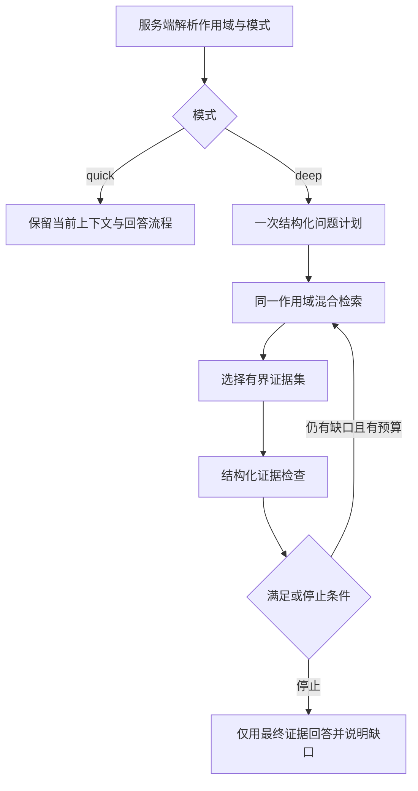

# 快速与深度书内问答设计

日期：2026-10-06。状态：用户已批准实施；核心功能与验收工具已实现，工程/真实效果状态见[验收记录](../../deep-reading-mode-acceptance.md)。配套[实施与验收计划](../plans/2026-10-06-deep-reading-mode.md)。

## 1. 本阶段契约

**Goal：** 在现有单书助手中提供快速、深度两种检索执行方式。快速保留现有 Planner + Milvus 向量 + 可见正文 BM25；深度用一个有界编排器，根据证据缺口最多补检两次，再回答。复杂问题能补齐依据，用户可以观察进度并随时停止。

**Done：** 两个入口可用；旧请求仍走快速；确定性测试证明轮数、调用数、取消和隔离；前后端质量门通过；隔离集成与固定题集对照报告按第 8 节给出证据。仅通过 mocks 不等于真实效果验收通过。

**Scope：** 修改 `server/src/chat/`、必要的查询 Embedding 调用选项，以及现有聊天 store/输入组件、相关测试与文档。不迁移数据，不改变 BM25 的统计范围，不把正文写入 Milvus，不增加生产依赖、模型供应商、环境变量或持久缓存。

**Risks：** 深度模式多次调用已有模型，延迟和费用增加；模型对证据充分性的判断可能出错；长书可能超过当前语料上限；已发出的部分外部请求不能即时取消。真实外部评测需要隔离环境、获准使用的语料和调用预算。

本方案沿用用户已确认的“向量用 Milvus，BM25 只对当前书已读正文计算”。用户在本方案交付后指示执行；UI、预算与第一版组合限制据此实施，效果门槛仍是预先声明的目标，不是测量结论。

## 2. 当前事实与范围选择

- 生产聊天入口是 `ChatController → BookChatService → BookContextService → BookChunkRetrieverService`。不要另建旧 `agent/`、`rag/` 路径。
- 正文事实源为 PostgreSQL 的 `BookChunk`。当前词法 profile、RRF 与容量限制见[混合检索记录](../../hybrid-retrieval-acceptance.md)。上一阶段真实集成、纯向量对照和质量提升仍待验收。
- 助手设置 `responseDepth: BRIEF | BALANCED | DEEP` 表示回答详略；新增 `retrievalMode: quick | deep` 表示检索执行方式，两者独立。
- 聊天页与阅读器面板复用 `InputArea`，实现一个入口即可覆盖两处。
- 运行时 skill 另有[绑定规范](../../agent-skills.md)。本阶段不增加运行身份、skill 或任意工具端口；书内编排器不能调用塔罗入口或加载其规则。

三个候选方向：只做固定多查询不能按缺口补检；立即做多 Agent 会增加协调、调用预算和评测变量；单编排器的计划、检索、检查循环满足当前目标且易验证。因此先实施第三种。多 Agent 留到本阶段证明收益后另行设计。

第一版深度限定书内事实与分析问答：不与联网、邮件草稿组合，不召回或自动提取长期记忆。保留当前书的助手语气、详略、用户指令和有界近期对话。原因是先把补检的增益、费用和失败语义测清楚，避免混入其他工具或记忆模型调用。快速模式的上述能力保持现有契约。这个限制需要在 UI 和验收中明确体现。

## 3. 用户与 HTTP 契约

`POST /api/chat` 新增可选字段：

```json
{"sessionId":"既有会话 UUID","message":"两人的态度为什么发生变化？","retrievalMode":"deep","spoilerOverride":false,"externalResearch":false}
```

- 未传字段或 `quick`：原快速路径，保留当前 Planner 查询集合、候选数、融合与提示词。
- `deep`：书内有界循环。不因为问题看起来复杂自动切换，也不自动回落快速。
- 非法枚举返回 HTTP 400，不能先申请运行租约或调用模型。
- `deep + externalResearch=true` 返回 400，code=`DEEP_MODE_EXTERNAL_UNSUPPORTED`。
- `deep` 且当前原始问题命中现有直接邮件意图检测，返回 400，code=`DEEP_MODE_EMAIL_UNSUPPORTED`。两项均在开启 SSE 前拒绝，避免忽略用户选项。
- 身份、会话、book、有效 embeddingVersion 和 spoilerCeiling 仍由服务端 resolve。客户端、计划模型、检查模型均不能传入这些权限值。

在“本次提问选项”加入快速/深度单选，默认快速，应用后显示当前选择，发送后恢复快速；切书、切会话、关闭阅读器面板时清除未发送的深度选择。深度选择时禁用联网并解释“深度模式本次只查书内原文”；返回快速不自动重新勾选联网。提交时仍做服务端组合校验。`responseDepth` 设置页面不改。

SSE 保留 `thinking/references/content/error/[DONE]`；新增可选 `runSummary`，旧客户端可忽略：

```ts
interface DeepRunSummary {
  mode: 'deep';
  stopReason: 'satisfied' | 'round_limit' | 'no_progress' | 'no_queries';
  retrievalRounds: number;
  incomplete: boolean;
}
```

`runSummary` 在最终引用之前发送一次。客户端在当前消息显示“已完成证据检查”或“依据有限”，不展示内部分析。常规状态文案固定为“正在拆解问题”“正在检索原文（第 n/3 轮）”“正在核对证据”“正在生成回答”。长阶段每 10 秒发送 `thinking: 正在等待本轮处理完成…`，只反映等待，不伪称取得证据；取消/结束后立即清理计时器。

SSE 运行失败增加可选 `code`，保留字符串 `error`。预算超时 `DEEP_MODE_TIMEOUT`；输出结构或引用 ID 非法 `DEEP_MODE_OUTPUT_INVALID`；来源权限/生命周期变化 `BOOK_CONTEXT_CHANGED`；其他阶段故障 `DEEP_MODE_UNAVAILABLE`。日志记录稳定码，前端显示可行动的脱敏文案。成功 `[DONE]` 一次；失败一个 error 后关闭；断开连接不再写事件。租约结束只执行一次。

## 4. 单编排器流程与内部契约



新增代码集中在 `server/src/chat/`：

```ts
type RetrievalMode = 'quick' | 'deep';
interface DeepSubquestion { id: string; text: string }
interface DeepBookPlan {
  subquestions: DeepSubquestion[];
  queries: string[];
}
interface DeepEvidenceCheck {
  coverage: Array<{
    subquestionId: string;
    status: 'supported' | 'partial' | 'missing';
    chunkIds: string[];
  }>;
  nextQueries: string[];
}
interface DeepBookResult {
  retrieved: RetrievedBookChunk[];
  subquestions: DeepSubquestion[];
  check: DeepEvidenceCheck;
  summary: DeepRunSummary;
}
type DeepBookEvent =
  | { type: 'thinking'; data: string }
  | { type: 'result'; data: DeepBookResult };
```

`DeepBookModelService.plan(query, recentMessages, signal, runId?): Promise<DeepBookPlan>` 与 `check(query, subquestions, selected, signal, runId?): Promise<DeepEvidenceCheck>`：使用已配置 Chat provider/model、现有 zod；无工具绑定，temperature=0、maxRetries=0。输出作为 unknown 严格校验，不允许额外权限、SQL、Agent ID 或工具字段。

`DeepBookContextService.run(context, query, signal, runId?): AsyncGenerator<DeepBookEvent>`：只调用上述模型与现有 retriever；成功恰好产生一个 result 后结束。异常抛给聊天层，不生成伪成功 result。`BookChatService` 用 `for await` 转发 thinking、接收 result，再执行一次最终回答。10 秒心跳由持有 SSE 生命周期的 ChatController 发送。

计划最多三个子问题，服务端统一编号 `q1…q3`。每条文本 1–500 字符；模型查询 1–1,000 字符。首轮服务端把原问题放在第一位，追加模型查询、去重后总数不超过三条。原问题沿用 API 10,000 字符限制，不静默截断。补检最多三条查询/轮，排除所有已执行查询，不要求每轮重新带上原问题。

近期历史由服务端读取，不允许模型选择 session；最多八条消息、合计 8,000 字符，从最近往前选完整消息，单条过大则跳过。历史是指代背景，不能替代原著证据。计划提示词分离策略与不可信用户/历史；检查只接收当前问题、子问题和本轮选中的原文。

检查 coverage 必须恰好对应全部子问题一次，ID 不可未知或重复；chunkIds 必须来自这次 selected 集合。supported 至少一个 ID；missing 不可带 ID；partial 可以为空。返回 nextQueries 不代表获得检索权限。检查是模型的证据判断，不是对事实真假的数学证明。

结构解析只接受完整 JSON，允许整个输出仅被一个 JSON/无语言 Markdown 代码框包裹时去除框标记，再执行同样的严格 schema 与引用检查；不从解释性文字中截取 JSON，不修复残缺 JSON。提示词使用合法的具体 status 示例，明确不输出额外字段或改写 ID。provider 标记 `finish_reason=length` 时拒绝截断输出，不重试或提高预算。输出校验失败的内部错误附带固定枚举 `stage/reason`，由控制器写入脱敏错误日志，不记录模型正文、问题、引用文本或动态字段名；公开错误码保持兼容。

证据合并以 chunkId 去重，不直接比较不同轮的融合分数。每轮最多返回八块、12,000 字符；累计候选最多 24 块、36,000 字符。检查和最终回答仅接收同一个 selected：最多八块、12,000 字符、每章最多三块，保留现有重叠去重。首次按首轮排名选；后续先按 q1…q3 轮询保留上一轮有效支持证据（每问题先取一块），再按各轮名次、早轮优先、chunkId 稳定填充。超长块不得截短后冒充完整证据；按预算跳过。检查器必须重新检查实际 selected，不能沿用已被挤出的证据状态。

停止规则按顺序执行：取消/租约丢失或权限状态变化→终止；达到 deadline→错误；全部 supported→satisfied；完成三轮→round_limit；从第二轮起候选集合没有新增 chunkId→no_progress；没有合法新查询→no_queries；否则补检。候选有新增但 selected 没改变仍可继续，最多三轮。不能为了补齐缺口扩大阅读范围。

## 5. 固定资源预算与失败语义

| 项目 | 第一版固定上限 |
| --- | --- |
| 计划模型 | 1 次；5 秒；输出 600 tokens |
| 证据检查模型 | 每轮 1 次、最多 3 次；每次 5 秒；输出 600 tokens |
| 最终回答模型 | 1 次；20 秒；输出 2,400 tokens；maxRetries=0 |
| 书内 Chat 模型总调用 | 最多 5 次，包括最终回答；不额外调用快速 Planner |
| 混合检索 | 初次 + 最多 2 次补检；每轮最多 3 查询 |
| 查询 Embedding | 每轮一次逻辑批调用；深度 maxAttempts=1；最多 9 查询文本 |
| Milvus 搜索 | 每查询一次，最多 9 次；保留现有每查询候选预算 |
| 计划/检索/检查阶段 | 合计 60 秒 |
| 完整在线响应 | 90 秒，自取得租约起；包括生成与会话落库 |
| 语料与词法 | 沿用 10,000 块、16 MiB、读取与评分各 5 秒等现有限制 |

每个提示词拼装后的字符串上限 40,000 字符，超限明确错误，不悄悄截掉原问题。字符上限与 maxTokens 是资源边界；不把字符估算称为严格输入 token 或金额上限。记录 provider 实际 usage，缺失标为 unavailable，不能写 0。第一版无 tokenizer、新供应商或按人民币费用熔断。

Embedding 逻辑批可能被现有 client 按 batchSize 拆成多个 HTTP 请求；每轮最多三条输入，底层请求数不超过三次、整次不超过九次，禁止隐藏重试。不能把逻辑批数当作实际 HTTP 调用数。

扩展 `embedBatch(texts, signal?, options?: { maxAttempts?: number })`，只有 deep 传 1；上传索引与 quick 保留配置。扩展检索 request 的可选 `embeddingMaxAttempts`，限定正整数且不允许高于既有配置。deep 另传 `completeChunksOnly` 与 `strictSectionLimit`，避免截断原块和章节限额回填；重叠定位 offset 仅作内部选择，不进入公共引用。每轮继续加载完整可见语料，最多三次；先不抽取缓存生命周期或重写词法结构。

编排阶段超时、结构输出非法、Embedding/Milvus/词法失败均报错，不能偷偷使用上一轮结果当作完成。正常轮数/无新证据停止允许回答已有依据，同时说明未解决子问题。超时必须停止，不能在 deadline 后启动“最后一次回答”。

父取消、阶段 deadline、请求 deadline 使用组合 signal。所有新调用前后、每次 yield、落库锁等待后与写库前检查。已有 Embeddings/Milvus 无即时取消保证：超时后在线请求必须在有界等待竞速中退出，保留拒绝处理器处理迟到结果，并禁止迟到检索、重试、事件和落库；在途调用由 provider 自身 timeout 收束。deep 将 signal 传到集合/schema 核验，阶段前后检查；READY 集合缺失时拒绝，不在读取期间创建索引。若已有其他调用的共享初始化则不取消其任务，但 deep 不再继续搜索。生成迭代器清理不得阻塞在线终止。不能只用 Promise.race 然后任由后台流程继续。

深度生成不走自动长期记忆提取；中间计划、检查结果和补检问题不进聊天历史或长期记忆。成功只保存原问题和最终答案一次。`appendExchange` 可选 signal 在历史锁等待后及更新前校验；已提交事务不能因随后取消回滚，对这条竞态明确记录边界。生成取消或失败不保存部分回答。客户端必须以 activeRequestId 隔离所有迟到事件，包括新增 summary；不要将结束的旧请求 memory_update 应用于新书。

## 6. 作用域与引用

一次运行冻结服务端 `ownerScope/bookId/embeddingVersion/spoilerCeiling`，三轮共用，不从模型结果重建过滤器。每轮沿用现有数据库与向量查询层过滤、生命周期复核，不能只做检索后过滤。

最终回答前重新 resolve 当前会话及书籍：owner、book、version、READY 不匹配，或当前阅读范围已收紧，拒绝。普通阅读进度增加不扩展本次 ceiling；显式本次 spoilerOverride 的上限按原授权使用，但不绕过书籍归属、READY 和版本复核。最终引用从 selected 原始对象构造，不能由模型提供 excerpt、bookId 或路径。

最终 Prompt 接收检查的 supported/partial/missing 状态；明确要求缺乏证据时说明范围和缺口，事实仅依据 selected，历史与检查内容不是原著。引用编号映射仅来自 selected，公共 references 最多八条。访问范围可确定性验证；模型是否准确解释片段、是否凭空补写事实，由固定题集人工核对，不宣称仅靠 Prompt 已保证语义正确。

## 7. 运行与可观测性

复用 admission 的 lease.runId 作为关联 ID；deep 不再申请第二份租约。脱敏日志记录 mode、阶段、轮次、停止码、模型标识、词法 profile、调用数、耗时、候选/最终块数、usage 是否可用。不得记录正文、问题、原文标题、历史、模型输出、token 凭据或账号标识。终态失败码须可与 runId 关联。

深度模式不绑定联网/邮件工具、不加载 runtime skill；通过拒绝组合与生产导入边界测试验证零外部工具调用和零未授权 skill 加载。快慢是检索策略选择，不是 Agent 身份选择。

## 8. 验收：基线、题集与门槛

### 8.1 工程硬门

下面每一项必须通过，不能用平均分掩盖安全失败：

1. 缺省/quick 的 Planner 查询、调用顺序、引用结果与改动前冻结记录一致；无需新增外部服务。
2. 三个子问题、三轮、九查询、五次书内 Chat 调用等上限均有 spy/假时钟证明；无 hidden retry。
3. 第一轮充分只运行一轮；第二轮补齐可正常停止；重复查询、无新增证据、空语料和无法补齐均按停止码结束。
4. 非法输出、词法/向量故障、超时显式失败；不能标记成功或静默换模式。
5. 跨用户、跨书、旧版本、未读章节、FAILED/DELETING 块均不进入计划检查上下文、引用或答案 Prompt；模型注入不能调用工具或改变作用域。
6. 用户停止、连接断开、失去租约、切书/切会话均使新调用数不再增加，迟到结果不改 UI 或落库；终态至多一次。
7. `server`、`client` 的相关测试和 `npm run check` 通过；外部测试安全门禁已核验。

### 8.2 可复现对照

冻结代码文件 hash、词法 profile、Planner 输出、语料/版本、模型配置、上下文预算、题集和评分表。由于工作区存在未提交改动，不能只记 HEAD。B0 必须复现混合检索修改前的 Planner + 纯向量路径；无法取得对应源码或冻结输出时记录 B0 缺失，不允许冒称对照完成。

- **B0：** 改动前纯向量 + 原 Planner。
- **B1：** 本轮开工时的快速混合路径，同一问题/历史/阅读进度。
- **B2：** 深度模式，模型计划可以变化；其他范围和最终证据预算相同。
- **消融：** 离线以相同查询集合回放 dense、BM25、hybrid；比较深度首轮与完整循环。离线回放不能替代 B0/B1/B2 端到端对照，也不增加生产 API 开关。

题集使用明确许可或合成的至少三本书、120 题：简单/专名 30，跨段/比较/时间线 45，追问 15，无可见依据/防剧透 15，注入与错误请求 15。每题提供固定历史、阅读上限、预期证据组（允许等价块）、关键结论和不可披露信息。分 40 题开发集、80 题冻结验收集，类别按比例分层；冻结验收集不得用于调权或调 Prompt。每个配置跑三次，固定 temperature=0，记录模型/provider 版本；仍不声称模型完全确定性。

指标分别报告：证据组覆盖率、最终答案关键结论准确率、无依据事实率、引用支持率、安全违规数、逐题改善/退化、完成率、耗时 p50/p95、实际 token/调用统计。答案盲评隐藏模式标签，至少一名非实现者复核所有改善/退化和全部安全用例。聚合重复运行按题目统计，不能把三次当作三倍独立样本。提供按题配对差值及置信区间，缺数据项标 unknown。

**预先声明的效果阶段门（拟定值，并非实验结论）：** 冻结复杂题子集上，B2 相比 B1 证据组完整覆盖率和正确答案率各提高至少 10 个百分点，三次运行的均值均达标；无依据事实率不高于 B1，安全违规为 0；B1 相对 B0 的简单题正确率下降不超过 5 个百分点。另单列改善/退化题数和区间，样本不足导致区间跨 0 时标“证据不足”，不宣传已证明普遍增益。同环境 B1 p95 不超过开工冻结 B1 的 1.1 倍；B2 请求在线期限 90 秒、成功完成率至少 95%，并单列超时与来源故障。

若工程硬门通过但未满足效果门，结论是“实现通过，效果未通过”，先定位开发集中的检索/证据选择问题，不增加多 Agent 或调冻结题集。没有安全隔离外部环境时只能交付离线验证，真实集成/效果栏保持未验收。

### 8.3 外部环境门禁

当前 `server/scripts/validate-private-reader-e2e.mjs` 会直接实例化 PrismaClient，并调用服务端上传/聊天；不能未核验目标就运行。新增专用隔离验收入口，先拒绝缺失或不安全环境，再实例化任何客户端。要求显式 TEST_DATABASE_URL、独立 `*_test` 数据库和 `test_*` schema，与 DATABASE_URL 完整比对 host/port/database/schema；书籍、记忆两个独立 `test_*` 向量集合和测试上传目录；测试 API/worker 配置必须指向同一组已核验目标。专用质量 API 使用 test provider 绑定真实记忆服务至测试集合，并关闭 ingestion worker，仅回放预先准备的合成 READY 书籍；不表示上传索引链路已验收。仅脚本自身数据库 URL 安全不代表 API 安全。变量、B0 输入、预算与操作顺序见[验收记录](../../deep-reading-mode-acceptance.md)。

运行前展示脱敏目标指纹、受控 fixture 前缀、预期创建记录和限定清理条件，确认实际模型调用预算与语料许可。不能自动修改 .env、启动可能连接实际库的 worker、清库、迁移或重建集合。无法证明服务端目标一致时拒绝外部验收。未授权清理时保留 fixture 并报告；任何清理仅限本次稳定前缀和明确 owner/book/version，禁止全表/全集合操作。

## 9. 交付与回退

交付源代码、相关测试、固定合成 fixture、离线验收脚本、隔离验收入口、脱敏报告模板；更新 `server/README.md` 与 `client/README.md` 的对应入口。不复制多份预算表，由本设计维护参数事实。

没有迁移或新持久索引。回退为部署上一版应用代码，已有数据结构兼容；保留深度模式已正常产生的历史，不做数据删除。未经用户指令不建分支、commit、push、PR 或部署。
